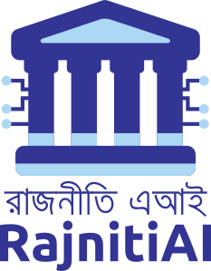

# My Logo Portfolio

Welcome to My logo collection! 

This repository showcases a collection of logo designs created by me. Each logo represents a unique concept and design approach.

## Antarjalik Logo

**About:**
Antarjalik is a group that supports the Bangladesh Students Union (BSU). They work online to promote socialism and fight against propaganda. 

## Red Foto Logo

**About:**
Red Foto is a community inspired from Counter Foto. They stand up for the people who are treated unfairly and say no to terrorism. They take pictures to show what's happening in the world.

## RajnitiAI Logo

**About:**
RajnitiAI is a community interested in technology and politics. They're aims to create political datasets to help make better decisions using artificial intelligence. 

## Techlighit IT Institute Logo

**About:**
Techlight IT Institute is a Leading IT company in Bangladesh since 2012. Offering top-notch training and testing services, catering to corporate and student needs nationwide. Dedicated to providing high-quality technical skill development with internationally certified staff.

# 👨‍🎨 Buy me a Coffee 
If you find value in what I'm creating, a small coffee donation would be a wonderful gesture ☕. 

# License

All of those designs licensed under the Creative Commons Zero v1.0 Universal. Please see [LICENSE](LICENSE.txt) for more information.
